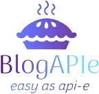

<h1 align="center">⚠️ Early Development Stage ⚠️</h1>

 This project is currently in the early stages of development and is not yet functional or stable. All aspects of the codebase are subject to change and are actively being worked on. Contributions are welcome; please contact me at <a href="mailto:gajdascz.dev@gmail.com">gajdascz.dev@gmail.com</a> so we can align on the project's direction.

<h2>Purpose and Goals</h2>

Develop a comprehensive full-stack blogging solution providing the following key features:
  <ul>
    <li>Backend: Implement a REST api </li>
    <li>Documentation: Provide meaningful and easy-to-follow documentation</li>
    <li>Client: Build user interfaces to quickly start reading and writing blogs</li>
    <li>Libraries: Develop a suite of utilities to streamline development and enforce consistency and best practices.</li>
    <li>Repository: Maintain a cohesive and structured package-based monorepo utilizing Nx to streamline management and automation.</li>
  </ul>

 
README (in-progress)

# BlogAPIe 🥧

